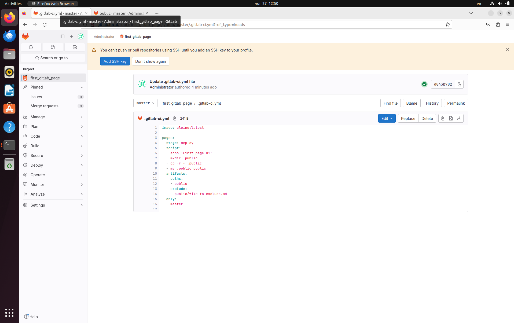
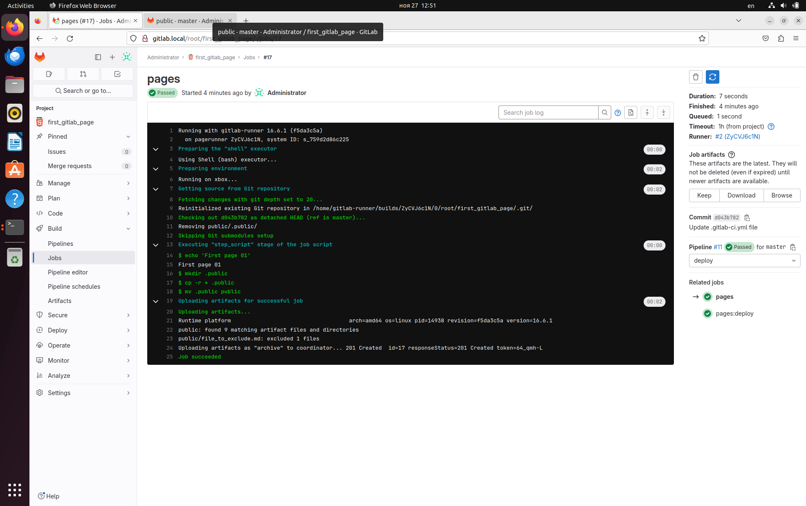
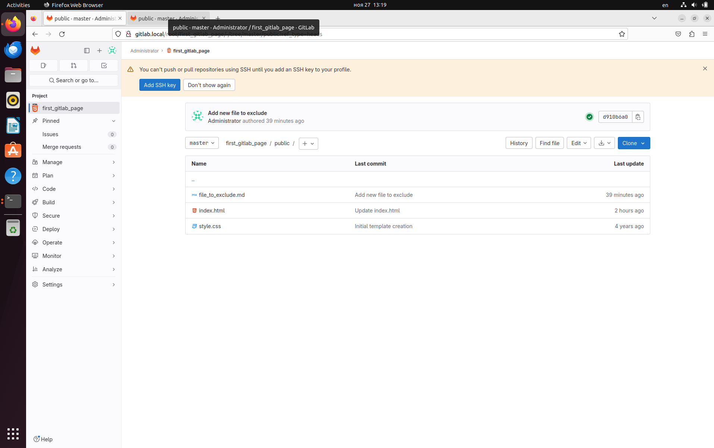

# CI/CD. Семинар 01

## Задача
1. Зарегистрироваться на gitlab.com
2. Создать pipeline и runner
3. Попробовать сохранить артефакт одной из стадий + исключить из папки с артефактами любой файл
4. Попробовать сделать любую gitlab pages

## Решение
1. Сразу проблема с регистрацией из России: поставил gitlab на локальную виртуальную машину
2. Файл .gitlab-ci.yml 


```yaml
image: alpine:latest

pages:
  stage: deploy
  script:
  - echo 'First page 01'
  - mkdir .public
  - cp -r * .public
  - mv .public public
  artifacts:
    paths:
    - public
    exclude:
    - public/file_to_exclude.md
  only:
  - master

```
Gitlab Runner также развернут на той же виртуальной машине, запущен для проекта. Статус: passed.

3. Исключение файла из папки с артефактами:
```yaml
...
  artifacts:
    paths:
    - public
    exclude:
    - public/file_to_exclude.md
...

```
4. gitlab pages… Epic fail! Для единственного локального сервера, чтоб на нем запустить и сам Gitlab, и Pages, — требуются усилия, превосходящие мои возможности. Хотя, судя по третьему скриншоту — процесс прошел удачно. И файлы index.html и style.css были обработаны, и file_to_exclude.md — отброшен.


## Скриншоты





