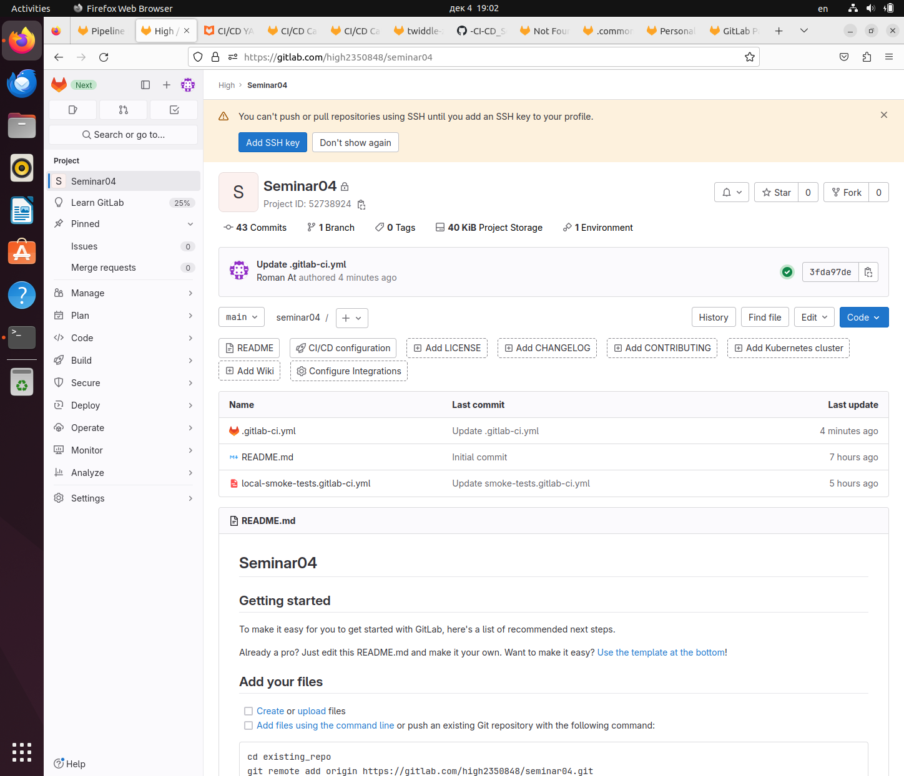
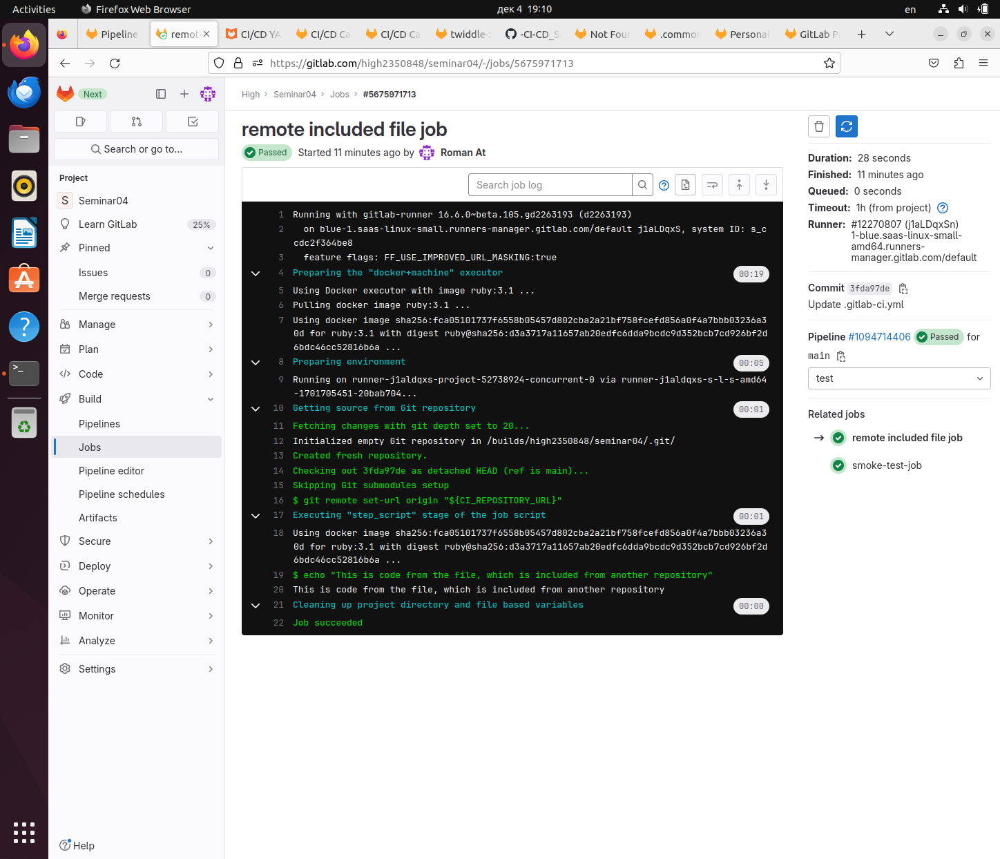
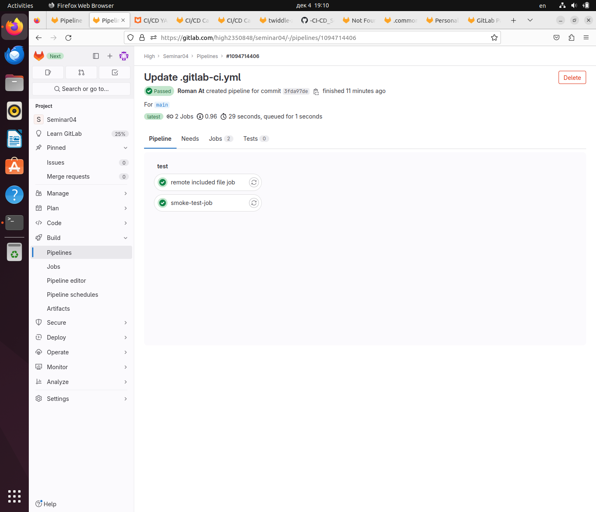

# CI/CD. Семинар 04. Troubleshooting (диагностика и решение проблем в CI/CD)

## Задача
Сделать локальный шаблон CI и отдельный репозиторий с шаблонами, подключить их к своему основному репозиторию через include


## Решение
Создан локальный файл `local-smoke-tests.gitlab-ci.yml`

```yaml
smoke-test-job:
  script: echo "SMOKE"
```

Создан основной файл `.gitlab-ci.yml`

```yaml
include:
  - local: local-smoke-tests.gitlab-ci.yml
#  - remote: https://github.com/Valinetsky/-CI-CD_Seminar04/blob/main/remote-included-file.yml
# К сожалению, ни собственные файлы в моих репозиториях, ни ссылка на гитхаб не сработали
# Поэтому взял ссылку у Максима Бобкова:
  - remote: https://gitlab.com/ci-cd7655047/5/-/raw/main/remote-included-file.yml
```

Файл с аналогичным содержанием, что и у Максима, есть в этом репозитории: `remote_included-file.yml`


Repository Seminar04


Remote included file job


Pipeline passed


## Благодарность
Спасибо Максиму Бобкову, без его кода pipeline не взлетал. Ссылка на гитхаб [тут](https://github.com/biramax/ "https://github.com/biramax/").

## Заключение
Курс дался не просто! От проблем с регистрацией, до работы с отдельностоящими удаленными репозиториями. Хотя, казалось бы `include` — стандартная копия импорта в языках программирования. Однако, задачи решены, а больше опыта можно взять на практических задачах. Ура!